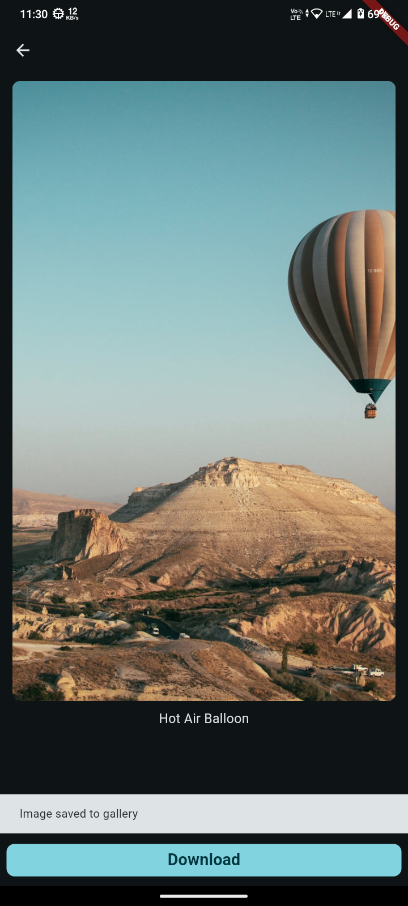

Here's the updated README content with the images displayed outside the table for better
presentation:

```markdown
# 📱 Wallpaper App

A Flutter-based wallpaper application using the [Pexels API](https://www.pexels.com/api/) that
allows users to search for, download, and view details of high-quality images.

## 📝 Features

- 🔍 **Search**: Users can search for wallpapers using keywords.
- ⬇️ **Download**: Images can be downloaded to the user's device.
- 👤 **Photographer Info**: View the photographer's name and ID associated with each image.
- 🆔 **Image Details**: View additional details like the image ID.

## 🚀 Getting Started

### Prerequisites

- Flutter SDK: [Install Flutter](https://flutter.dev/docs/get-started/install)
- Pexels API Key: [Sign up for an API key](https://www.pexels.com/api/)

### Installation

1. **Clone the repository**:
   ```bash
   git clone https://github.com/sanket92011/maxWalls.git
   cd maxWalls
   ```

2. **Install dependencies**:
   ```bash
   flutter pub get
   ```

3. **Configure the API key**:
   Create a `secrets.dart` file inside the `lib/` folder and add your Pexels API key:
   ```dart
   // lib/secrets.dart
   const String ACCESS_KEY = 'YOUR_API_KEY_HERE';
   ```

4. **Run the app**:
   ```bash
   flutter run
   ```

## 📷 Pexels API Integration

The app leverages the [Pexels API](https://www.pexels.com/api/) to fetch stunning images. You'll
need to sign up for an API key to access their image database.

### Setting up the API Key

```dart
// lib/secrets.dart
const String ACCESS_KEY = 'your-pexels-api-key';
```

Make sure to replace `'your-pexels-api-key'` with your actual API key.

## 📦 Dependencies

This app uses the following Flutter packages:

- [`http`](https://pub.dev/packages/http) - For making HTTP requests to the Pexels API.
- [`flutter_cache_manager`](https://pub.dev/packages/flutter_cache_manager) - For caching and
  managing image downloads.
- [`cached_network_image`](https://pub.dev/packages/cached_network_image) - For rendering images
  efficiently from the web.

## 📸 Screenshots

### Home Screen


### Filter Selection


### Search Screen


### Image Info


### Download Image



> **Note:** Replace the dummy image paths with the actual paths to the screenshots in your project.

## 💻 Contributing

Contributions are always welcome! If you'd like to contribute, please:

1. Fork this repository.
2. Create a new branch for your feature (`git checkout -b feature/YourFeature`).
3. Commit your changes (`git commit -m 'Add YourFeature'`).
4. Push to the branch (`git push origin feature/YourFeature`).
5. Open a Pull Request.

## 📜 License

This project is licensed under the MIT License - see the [LICENSE](LICENSE) file for details.

## 🙏 Acknowledgments

- Thanks to [Pexels](https://www.pexels.com) for their incredible library of free images.
- The Flutter community for their continuous support and contributions to the ecosystem.
 

